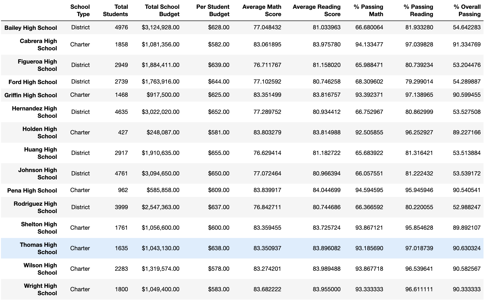

# School District Analysis

## Overview
The City School Board has assigned us with categorizing and analyzing the standardized testing results for 15 schools in order to better understand their performances based on school size, budget, type of school, and more. From this analysis, the board will make decisions on budget allocation for the schools and which schools should be prioritized based on their performance. However, there was recent evidence of academic dishonesty from the Thomas High School for its ninth graders' reading and math scores. This has prompted us to replace the test score data from Thomas High School's ninth graders with NaNs. Thus, we have recoded our script in order to reflect this and will present the newly calculated results.

We worked with the following resources to generate the results:

Data Source: schools_complete.csv and students_complete.csv
Software: Python 3.7.6, Jupyter Notebook 

## Results

### District Summary
- The difference in results after the adjustment for the untrustworthy data, shown below, are insignificant. The values for "average math score", "% Passing Math", "% Passing Reading", and "% Overall Passing" are all slightly lower for the updated numbers, but only by tenths of a whole number and if the updated district summary were rounded like the original values the values would be the same. 
  - Original: 
  - Updated: 

### School Summary
- The school summaries required an extra adjustment as shown below. The first time the code was updated, it was still accounting for the ninth grade students in the total number of students, which affected the percentage. However, once this was corrected the results were very similar to the original, differing by tenths of a whole number.
  - Original: 
  - Updated: 
  - Final: 

### Thomas High School and the rest of the schools in the district
- There was no change in the rankings of the top five performing schools in the district even after the removal of ninth grade data, as Thomas High School still landed in second, again with negligible changes to their percentage values.
  - Original: 
  - Updated: 
- The math and reading scores for all schools were not affected, as we only had to replace the ninth grade scores at Thomas High school to NaNs.

### Effects of the replacing the ninth grade data
- School Spending
  - Thomas High School had a budget of $638.00 per student, which placed them in the $630-644 range, which as shown in the tables below had no effect after the numbers were rounded.
  - Original: 
  - Updated: 
  
- School Type
  -  Thomas High School is a charter school, and similarly this did not result in any effect once the values were rounded to the nearest whole number.
  - Original: 
  - Updated: 
  
- School Size
  - Thomas High School had a total 1635 students, which placed them in the medium school size. This category also showed no effect from the replacement of the data after the numbers were rounded.
  - Original: 
  - Updated: 
  
  
## Summary
- After we created a script to help categorize and analyze the test score data for the school district. We had to make an amendment to our code in order to account for the academic dishonesty in the ninth grade test results from Thomas High School in the original data, replacing it with NaNs. The effect of this change to our data was negligible, as in all of our measurements and analysis the deviations would not be visible after rounding. However, we did need to make key adjustments in our code to ensure that this unreliable data would not effect the school board's decision making. 
  
  - Our first major task was cleaning out the ninth grade data by replacing it with NaNs which is seen below.
    - 
  - Our next task was then to create new student counts that did not include the ninth graders in order to not effect our calculations.
    - 
  - This caused us to calculate the updated values for the number of students at Thomas High School passing math, passing reading, and passing both, as well as their respective percentages.
    - 
  - Lastly, we had to replace the original values in our data frame with the updated ones.
    - 
